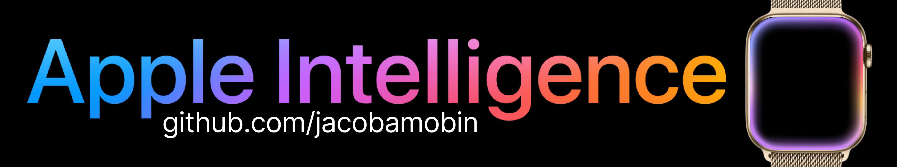
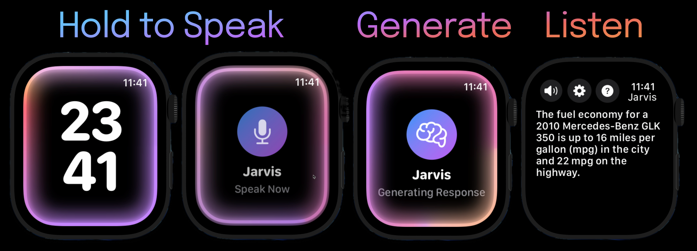
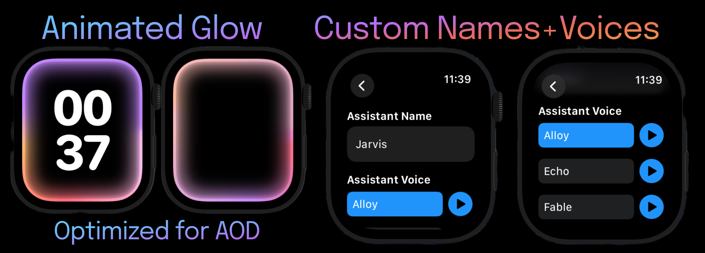
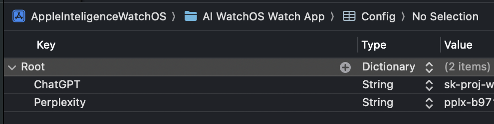

Making your apple watch even more powerful!

Go watch the [Youtube Video](https://www.google.com/search?q=coming+soon)

Go download on the [AppStore](https://www.google.com/search?q=coming+soon)




- Powered by Perplexity (Data and Responses) and ChatGPT (Whisper and TTS)
> [!Tip]
> If your looking for just the [Glow Animations](https://github.com/jacobamobin/AppleIntelligenceGlowEffect) you can find them here

# Features 
- Customizable assistant name
- Customizable assistant voices (6)
- Chose 12/24 hour time on clockface
- Animated glow effect optimized for battery

# Guide
- Hold on the clock screen and start speaking
- Once your done speaking let go of the screen
- Your prompt will get sent to Perplexity
- After a few secconds you will see the response
- A TTS model will begin speaking the response 

# Privacy Policy
Check out the [Privacy Policy](PRIVACY.md)

# Appstore Version


# Setup
> [!Warning]
> I highly suggest using the AppStore version, otherwise to follow the following steps you will need a [Perplexity](https://docs.perplexity.ai/home) and [OpenAI](https://platform.openai.com/docs) Api key.
1) Clone this repository and open the project in Xcode
2) In the ```AI WatchOS Watch App``` of the project create a file named Config.plist
3) In config plist add 2 keys under Root, ChatGPT and Perplexity, both shall hold strings
4) Add your api keys in the string section of both keys

5) Build the project to your apple watch

# Future Features 
Feel free to commit.
- IMessage Support
- Mail Support
- Notes Support
- Alarm Support
- Reminders Support
- Navigation Support (Google Maps)
- Optimization
- Remove stock clock for Github Users
- Fix some spacing issues
- Make gradient glow more reactive
- Add support for other models (Github Only)

# Contributing/Support
Manager: [@jacobamobin](https://github.com/jacobamobin)
This was built using [OpenAI Swift](https://github.com/MacPaw/OpenAI/issues) by [Macpaw Inc](https://github.com/MacPaw)

> [!Important]
> Familiarize yourself with the [license](LICENSE.md) before committing
